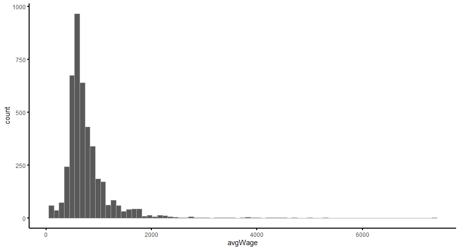
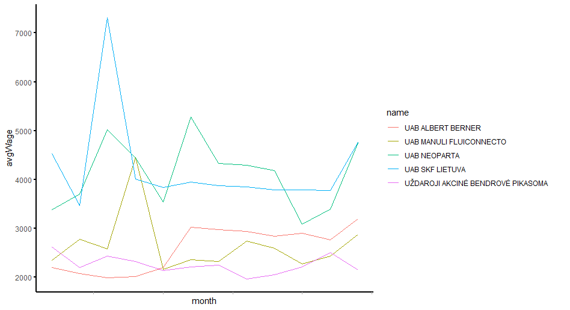

# R Laboratorinis darbas: duomenų vizualizacija

| Variantas | ecoActCode |
|------------- | ------------- |
|4   | 453200 |

### 1. Užduotis

Atsakymas:

Išvados:
Nubrėžtoje histogramoje vaizduojamas variklinių transporto priemonių atsarginių dalių ir pagalbinių reikmenų mažmeninėje prekyboje vidutinis atlyginimas.

### 2. Užduotis

Atsakymas:

Išvados:
Linijinėje diagramoje vaizduojama 5-kių didžiausių, pagal vidutinį darbo užmokestį, variklinių transporto priemonių atsarginių dalių ir pagalbinių reikmenų mažmeninės prekybos srityje, įmonių vidutinio atlyginimo kitimo dinamika metų eigoje.

### 3. Užduotis

Atsakymas:

Išvados:
Stulpelinėje diagramoje (mažėjimo tvarka) vaizduojamas, 5-kių didžiausių, pagal vidutinį darbo užmokestį,variklinių transporto priemonių atsarginių dalių ir pagalbinių reikmenų mažmeninės prekybos įmonių, maksimalus apdraustų darbuotojų skaičius per 2020 metus.

### 4. Užduotis

Shiny R aplikacijos nuotrauka:

